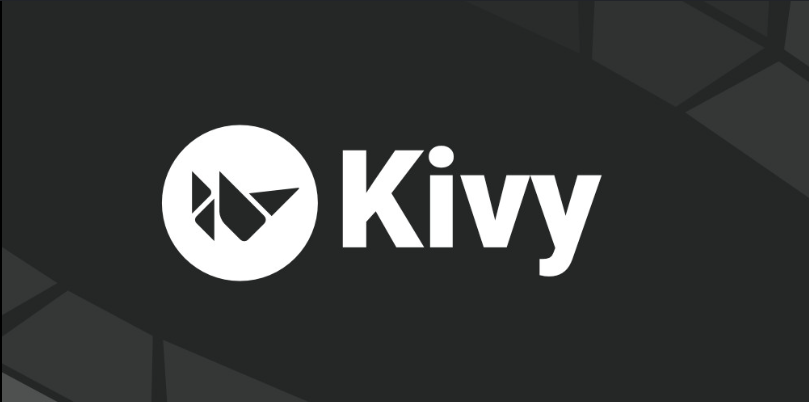

<div align="center">

# 🚀 FNB App Academy 2026

### _Learning • Building • Growing as a Software Developer_

<p>
  
</p>


</div>

---

# 📖 About the Repository

Welcome to my **FNB App Academy Portfolio**.

This repository documents my journey through the **FNB App Academy**, where I developed practical software development skills through hands-on projects, coding challenges, and real-world application development.

The work contained in this repository demonstrates my understanding of Python programming, object-oriented programming, user interface development with Kivy, API integration, and software design principles.

This repository serves as both a learning archive and a portfolio showcasing my progress as an aspiring software developer.

---

# 🎯 Repository Objectives

- Learn modern software development principles
- Strengthen Python programming skills
- Build desktop and mobile applications
- Apply Object-Oriented Programming concepts
- Develop user interfaces using Kivy
- Consume APIs and display live data
- Practice problem-solving and debugging
- Track learning progress
- Showcase completed academy projects

---

# 📚 FNB App Academy Curriculum

| Module                              | Description                                                          |   Status    |
| ----------------------------------- | -------------------------------------------------------------------- | :---------: |
| 🐍 Introduction to Python           | Python syntax, variables, input/output, and programming fundamentals |     ✅      |
| 🔤 Manipulating Strings             | String methods, formatting, slicing, concatenation, and validation   |     ✅      |
| 🔢 Manipulating Numbers             | Arithmetic operations, mathematical functions, and calculations      |     ✅      |
| 💾 Storage and Access               | Variables, lists, dictionaries, tuples, and data access              |     ✅      |
| 🔀 Selection of Tasks               | Conditional statements using `if`, `elif`, and `else`                |     ✅      |
| 🔁 Repeating Tasks                  | `for` loops, `while` loops, iteration, and loop control              |     ✅      |
| 💡 Design Thinking                  | User-centered design, brainstorming, planning, and problem solving   | ⏳ Upcoming |
| 🏗 Object-Oriented Programming      | Classes, objects, inheritance, encapsulation, and polymorphism       | ⏳ Upcoming |
| 📂 File Handling & Error Management | Reading/writing files, exception handling, and debugging             | ⏳ Upcoming |
| 🎨 Kivy UI Basics                   | Creating graphical user interfaces with Kivy                         | ⏳ Upcoming |
| 📱 Multi-Screen App Development     | Building applications with multiple screens and navigation           | ⏳ Upcoming |
| 🌐 APIs & Live Data                 | Working with APIs and displaying real-time information               | ⏳ Upcoming |
| 🚀 Build Sprint                     | Developing an application using Agile principles                     | ⏳ Upcoming |
| 🏆 Final App Showcase               | Presenting and demonstrating the completed project                   | ⏳ Upcoming |

---

# 🧠 Skills Acquired

Throughout the academy, I gained practical experience in:

- Python Programming
- Object-Oriented Programming (OOP)
- Data Structures
- File Handling
- Exception Handling
- Debugging
- API Integration
- GUI Development using Kivy
- Multi-Screen Application Development
- Design Thinking
- Software Development Lifecycle
- Git & GitHub
- Version Control
- Problem Solving
- Agile Development

---

# 🛠 Tech Stack

### Languages


### Development Tools


### Frameworks


---

# 📂 Repository Structure

```text
fnb_academy/
│
    ├── App_academy/
        ├── assignment-01-caculator.py/
        ├── assignment-02-contact_book.py/
        ├── assignment-03-grade_report.py/
        ├── assignment-04-statements.py/
        ├── assignment-05-string_formatter.py/
        ├── assignment-06-student_info.py/
    ├── Lessons/
        ├── lesson_1.py/
        ├── lesson_2.py/
        ├── lesson_3.py/
        ├── lesson_4.py/
        ├── lesson_5.py/
        ├── lesson_6.py/
    ├── Unit_challenges/
        ├── unit_1_concert_ticket_booker.py/
        ├── unit_2_secure_password.py/
        ├── unit_3_fuel_cost_calculator.py/
        ├── unit_4_smart_atm.py/
        ├── unit_5_high_score.py/
        ├── unit_6_phone_directory_searcher.py/
│
├── images/
│   ├── kivy-ui.png
│   ├── banner.png
│   └── python-project.png
│
└── README.md
```

---

# 📸 Project Gallery

## Introduction to Python


---

## Kivy User Interface



---

## Final Application


---

# 🚀 Featured Projects

| Project                      | Description                         |
| ---------------------------- | ----------------------------------- |
| Python Fundamentals - course | Core Python programming exercises   |
| Object-Oriented Programming  | Class-based application development |
| Kivy UI Project              | Building graphical user interfaces  |
| API Integration              | Working with live web data          |
| Final Application            | Complete capstone project           |

---

# 💻 Getting Started

Clone the repository:

```bash
git clone https://github.com/Samukelo-Nkosi/fnb_academy.git
```

Navigate to the repository:

```bash
cd fnb_academy
```

Open in Visual Studio Code:

```bash
code .
```

---

# 📈 Repository Statistics

> GitHub automatically updates these badges.


---

# 🌟 Learning Outcomes

By completing the FNB App Academy, I have strengthened my ability to:

- Design software solutions
- Build Python applications
- Develop graphical user interfaces
- Integrate external APIs
- Write clean and maintainable code
- Debug software efficiently
- Apply object-oriented programming principles
- Collaborate using Git and GitHub

---

# 🤝 Contributing

This repository contains my coursework and projects completed during the FNB App Academy.

Suggestions, improvements, and feedback are welcome through Issues and Pull Requests.

---

# 📄 License

This project is licensed under the MIT License.

See the `LICENSE` file for details.

---

# 👨🏽‍💻 Author

## Samukelo Nkosi

**Aspiring Software Developer**

- 🎓 Diploma in ICT Student
- 💻 FNB App Academy Participant
- 🌱 Passionate about Software Development
- 🚀 Continuously learning and building practical applications

---

<div align="center">

### ⭐ If you found this repository helpful or interesting, consider giving it a star please!

**_"Every expert was once a beginner who kept learning."~SK NKOSI_**

</div>
